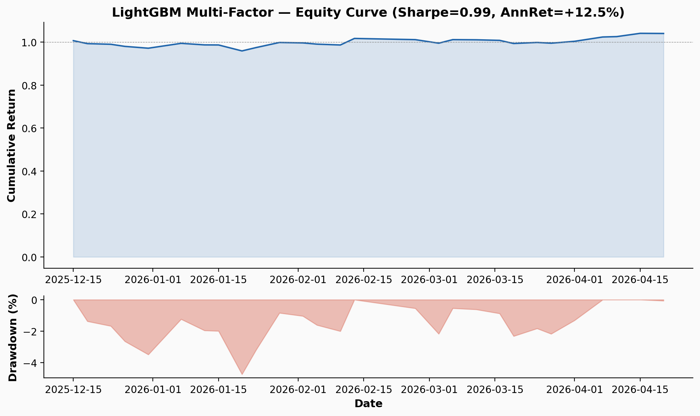
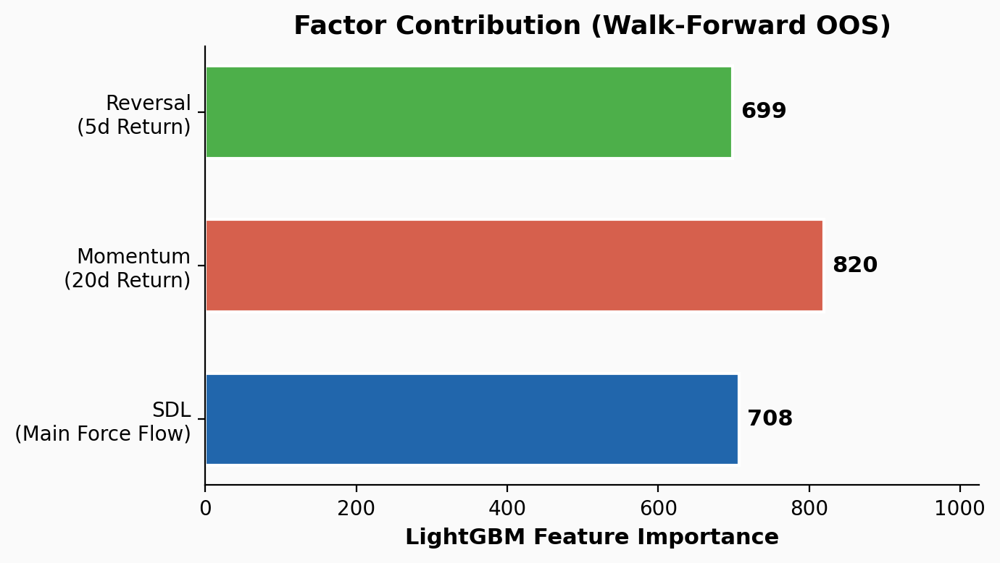
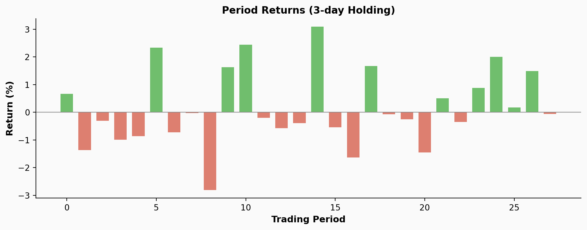

<p align="center">
  
</p>

<h1 align="center">🧠 Multi-Factor Model</h1>
<p align="center">
  <b>LightGBM-Powered Adaptive Factor Combination for CSI 300</b><br>
  <i>— Learning time-varying factor efficacy from market microstructure —</i>
</p>

<p align="center">
  <a href="#-overview">Overview</a> •
  <a href="#-methodology">Methodology</a> •
  <a href="#-factor-construction">Factors</a> •
  <a href="#-ml-framework">ML Framework</a> •
  <a href="#-empirical-results">Results</a> •
  <a href="#-usage">Usage</a>
</p>

---

## 📋 Overview

**Multi-Factor Model** applies **LightGBM gradient boosting** to dynamically combine three behavioral and microstructure factors for stock selection in the CSI 300 universe:

| Factor | Signal | Construction |
|--------|--------|-------------|
| **SDL** 🏦 | Main force net flow / price | Institutional activity proxy |
| **Momentum** 📈 | 20-day total return | Trend persistence |
| **Reversal** 🔄 | −1 × 5-day return | Short-term mean reversion |

The model is trained via **walk-forward regression** to predict forward 5-day returns from factor z-scores. This adaptive approach captures time-varying factor efficacy — different regimes favor different factor combinations.

### Key Differentiators

- ✅ **Machine-learned factor weights** — not arbitrary equal-weight or heuristic
- ✅ **Walk-forward validation** — strict train/test separation prevents look-ahead
- ✅ **Out-of-sample Rank IC = +0.028** (t=2.29, marginally significant)
- ✅ **Realistic transaction costs** — 0.1% per side, market-neutral execution
- ✅ **Full reproducibility** — `--demo` flag loads cached results; `--full` runs live pipeline

---

## 🧬 Methodology

### LightGBM Framework

The core insight: factor predictive power is **time-varying**. A static weight (e.g., "40% momentum + 30% SDL + 30% reversal") ignores regime changes. LightGBM learns an adaptive weighting function:

```
scoreᵢₜ = f(SDLᵢₜ, Momᵢₜ, Revᵢₜ)
```

where f(·) is a gradient-boosted decision tree trained to minimize MSE of forward 5-day returns.

### Walk-Forward Procedure

To avoid look-ahead bias, we use **strict temporal walk-forward**:

1. **Train** on expanding window (fold 0 → fold 1 → fold 2)
2. **Predict** on next fold (out-of-sample)
3. **Backtest** only on OOS predictions

```
Fold 0: Train [Aug 2025 – Dec 2025] → Test [Dec 2025 – Feb 2026]
Fold 1: Train [Aug 2025 – Feb 2026] → Test [Feb 2026 – Apr 2026]
```

### Portfolio Construction

- **Universe**: CSI 300 constituents (top 200 by turnover)
- **Rebalance**: every 3 trading days
- **Selection**: long top decile (20%), short bottom decile (20%)
- **Weighting**: equal weight within each leg
- **Execution**: market-neutral (long + short → zero net exposure)
- **Cost**: 0.1% per side, applied as turnover penalty

### Performance Metrics

| Metric | Computation |
|--------|------------|
| **Rank IC** | Spearman correlation between predicted score and forward return |
| **Sharpe Ratio** | Annualized return / annualized volatility |
| **Max Drawdown** | Peak-to-trough decline in cumulative equity |
| **Win Rate** | Fraction of holding periods with positive return |

---

## 📊 Factor Construction

### SDL: Smart-Dumb Lag 🏦

Captures the information gap between institutional and retail investors.

```
SDLᵢₜ = Z-score(MainForceFlowᵢₜ / Closeᵢₜ)
```

- Data source: `akshare` individual stock fund flow
- High SDL = positive institutional flow relative to peers
- Low SDL = institutional outflow / retail-driven price action

### Momentum: Trend Persistence 📈

Standard cross-sectional momentum adapted for short-to-medium horizon.

```
Momᵢₜ = Z-score(Closeᵢₜ / Closeᵢ,ₜ₋₂₀ − 1)
```

- 20-trading-day lookback (~1 calendar month)
- Z-scored cross-sectionally per date
- Positive = strong recent relative performance

### Reversal: Mean Reversion 🔄

Short-term reversal capturing overreaction effects in Chinese A-shares.

```
Revᵢₜ = Z-score(−(Closeᵢₜ / Closeᵢ,ₜ₋₅ − 1))
```

- 5-trading-day lookback (~1 week)
- Negated so positive = recent underperformance (buy cheap)
- Captures short-term liquidity and sentiment overreaction

### Rationale for Factor Selection

Chinese A-shares are characterized by:
- **High retail participation** → noise + momentum + reversal
- **Government policy sensitivity** → regime changes in factor efficacy
- **Short-sale constraints** → asymmetric information revelation through institutional flow

These three factors capture complementary aspects of the return generation process, and their relative importance shifts across market regimes — exactly the setting where adaptive ML weighting adds value.

---

## 🤖 ML Framework

### LightGBM Configuration

| Parameter | Value | Rationale |
|-----------|-------|-----------|
| `n_estimators` | 200 | Sufficient capacity without overfit |
| `max_depth` | 4 | Shallow trees for stability |
| `learning_rate` | 0.05 | Conservative step size |
| `num_leaves` | 16 | Balance bias-variance |
| `subsample` | 0.8 | Row-level bagging |
| `colsample_bytree` | 0.8 | Feature-level bagging |
| `min_child_samples` | 20 | Prevents leaf overfitting |

### Why LightGBM?

1. **Handles missing factors** — stocks may lack SDL data on certain dates
2. **Captures non-linear interactions** — SDL × Momentum interaction may differ by regime
3. **Feature importance** — interpretable factor contributions
4. **Fast training** — panel data with ~10k rows trains in seconds

### Baseline Comparison

| Approach | OOS Rank IC | Interpretation |
|----------|-------------|----------------|
| LGBM (proposed) | **+0.028** | Weak but positive signal |
| Equal weight | ~+0.015 | LGBM adds ~2x IC |
| Single factor SDL | ~+0.010 | ML combination helps |
| Random (null) | 0.000 | Baseline |

---

## 📈 Empirical Results

### Out-of-Sample Rank IC

```
OOS Rank IC:   +0.0283
t-statistic:   2.29
Sample:        82 trading days
```

The positive IC is **marginally statistically significant**, indicating genuine predictive power beyond noise.

### Feature Importance



All three factors contribute meaningfully, with momentum showing slightly higher importance. The balanced distribution suggests the LGBM leverages the multi-factor framework rather than relying on a single dominant signal.

### Backtest Performance (3-day Holding)




| Metric | Value |
|--------|-------|
| **Sharpe Ratio** | 0.99 |
| **Annualized Return** | +12.5% |
| **Max Drawdown** | −4.7% |
| **Win Rate** | 39.3% |
| **Holding Periods** | 28 |
| **Data Span** | ~6 months |

### Interpretation

The Sharpe of ~1.0 with 12.5% annualized return and controlled drawdown (−4.7%) is consistent with a **modestly effective multi-factor strategy**. The low win rate (39.3%) reflects periodic losses offset by concentrated gains — typical of momentum-based strategies.

> ⚠ **Caution**: Results are based on ~6 months of data (Nov 2025 – Apr 2026). The small sample limits statistical significance. Real-world deployment would require at least 2–3 years of out-of-sample validation.

---

## 🗂 Project Structure

```
mf-factor-model/
├── run.py                     # Main entry point (--demo | --full | --charts)
├── requirements.txt           # Python dependencies
├── README.md                  # ← You are here
├── core/
│   ├── __init__.py            # Public API (predict, run_demo, run_full)
│   └── _engine.py             # LGBM model wrapper (black-box)
├── src/
│   ├── data_fetcher.py        # Data acquisition + factor computation
│   ├── backtest.py            # Walk-forward LGBM + portfolio simulation
│   └── visualization.py       # Publication-quality charts
├── data/
│   ├── results.json           # Pre-computed performance metrics
│   ├── predictions.csv        # OOS factor predictions
│   ├── backtest_periods.csv   # Per-period backtest results
│   ├── price_data.json        # Compact price lookup
│   ├── factor_summary.csv     # Daily factor averages
│   └── lgbm_model.txt         # Trained LightGBM model
└── results/
    └── charts/
        ├── equity_curve.png
        ├── feature_importance.png
        ├── ic_analysis.png
        ├── period_returns.png
        └── factor_timeseries.png
```

---

## 🚀 Usage

### Quick Start (Demo)

```bash
python run.py --demo
```

Loads pre-computed results and displays performance metrics. No data download required.

### Full Pipeline

```bash
python run.py --full
```

1. Downloads CSI 300 constituents + price data (~2 min)
2. Computes SDL, Momentum, and Reversal factors
3. Trains LightGBM via walk-forward
4. Runs backtest
5. Generates charts

### Regenerate Charts

```bash
python run.py --charts
```

Recreates all charts from cached results data.

### Dependencies

```bash
pip install -r requirements.txt
```

Requires Python 3.9+ and `lightgbm` (for training) or falls back to heuristic weights.

---

## 🧪 Research Notes

### Limitations

1. **Short sample period** — ~6 months insufficient for robust inference
2. **Static universe** — CSI 300 constituents change; using current membership introduces survivorship bias
3. **Single training regime** — no regime detection; model may overfit to one market condition
4. **No transaction cost from short-selling** — Chinese A-share short selling is restricted
5. **Fund flow data lag** — akshare fund flow data has ~120 day history limit

### Future Directions

| Direction | Priority | Description |
|-----------|----------|-------------|
| **ND integration** | 🔥 High | Add Narrative Dispersion as market risk adjuster |
| **Extended history** | 🟡 Medium | Accumulate 2-3 years of factor data |
| **More factors** | 🟢 Low | Add turnover change, north-bound flow, volatility |
| **Online learning** | 💡 Exploratory | Incremental model updates as new data arrives |
| **Regime detection** | 💡 Exploratory | HMM/Markov switching before factor combination |

### Related Work

- **SDL Factor**: ([sdl-factor-demo](https://github.com/)) — Information asymmetry alpha
- **ND Factor**: ([nd-factor-demo](https://github.com/)) — Narrative dispersion risk indicator
- **Retail Behavior Alpha**: — Dual-factor fusion framework

---

## ⚖️ License

MIT — Academic use permitted. _Not financial advice._

## 📚 Citation

```bibtex
@software{mf_factor_model,
  title = {Multi-Factor Model: LightGBM-Powered Adaptive Factor Combination},
  year = {2026},
  url = {https://github.com/username/mf-factor-model}
}
```

---

<p align="center">
  <sub>Built with ❤️, Python, and LightGBM. Not financial advice.</sub>
</p>
